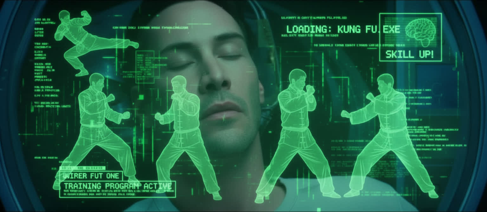

# 🥋 I Know Kung Fu

  

<em>“I know kung fu.” — Neo 
Image © Warner Bros. Pictures, used under fair use for educational and thematic purposes.</em>

🥋 **Welcome to the dojo.**

> _“I know kung fu.” — Neo_

This repository is named after that iconic moment—not because we teach martial arts, but because of what it symbolizes: the instant transfer of skill, knowledge, and capability. That’s the promise of AI agents. That’s what this repo helps you unlock.

Whether you're a Microsoft partner, customer, trainer, or simply #EternallyCurious, this is your plug-in point to accelerated learning. Inside, you’ll find modular resources to help you master Copilot Studio, Azure AI Foundry, Agent Framework, Power Platform, and Modern Work—through demos, playbooks, and thematic training modules.

> _“What are you waiting for?” — Morpheus_

Start with [`training-modules/`](training-modules/) to begin your journey.

---

> This is where your “I know kung fu” moment begins.

---

## 🎯 Purpose

This repository equips Microsoft partners and customers with:
- Training modules and enablement decks
- Real-world demos and templates
- Adoption playbooks and onboarding guides
- Multilingual resources for global rollout
- Strategic frameworks for AI and Modern Work

---

## 🗂️ Repo Structure

| Folder | Description |
|--------|-------------|
| `assets/` | Images, logos, branding visuals (e.g., Neo_plugged.jpg) |
| `docs/` | Markdown guides, onboarding instructions, architecture diagrams |
| `training-modules/` | Slide decks, session outlines, recordings 🥋 |
| `copilot-demos/` | Templates, walkthroughs, mock data |
| `partner-resources/` | Battlecards, competitive positioning |
| `customer-playbooks/` | Adoption strategies, onboarding flows |
| `multilingual-assets/` | Translated materials |
| `community-links/` | Forums, blogs, videos |

> 🥋 **First time here? Begin your journey in [`training-modules/`](training-modules/)**  
> It’s where the onboarding guides, field notes, and learning modules live.

---

## 🧠 Who This Is For

- Microsoft partners delivering enablement sessions
- Customers adopting AI and Modern Work solutions
- Trainers, consultants, and strategists building scalable programs
- Anyone who wants to move from “I’m curious” to “I know kung fu”

---

## 🤝 Contributions

Fork it. Clone it. Add your moves.  
This dojo is open to all who seek mastery.

---

## 📬 Contact

🧠 Maintained and curated with care by [Alejandro Araujo](https://www.linkedin.com/in/a2araujo)  
💬 For feedback, sparring, or collaboration, open an issue or connect via LinkedIn.  
🏷️ #EternallyCurious
