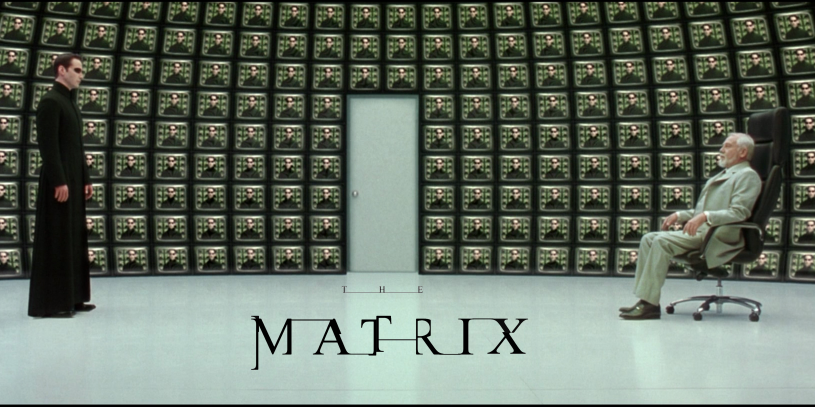

# 🧠 Docs

  

<em>“You are the eventuality of an anomaly…” — The Architect 
Image © Warner Bros. Pictures, used under fair use for educational and thematic purposes.</em>

Welcome to the **knowledge core** of the `i-know-kung-fu` repo. This folder contains all documentation that supports onboarding, architecture, contribution, and thematic enablement.

Whether you're a partner, customer, or fellow #EternallyCurious contributor, this is your launchpad into the Matrix.

---

## 📚 Contents

- [`onboarding-guide.md`](onboarding-guide.md) — Get started with the repo and its purpose  
- [`architecture-overview.md`](architecture-overview.md) — Understand the solution components  
- [`contributing.md`](contributing.md) — Learn how to contribute and collaborate  
- [`license.md`](license.md) — Review usage rights and licensing terms  
- [`visual-style-guide.md`](visual-style-guide.md) — Stay on-brand and copyright-safe  

---

## 🧭 Navigation Tips

- All files are written in Markdown for easy readability and GitHub rendering.
- Diagrams and visuals are stored in [`assets/`](../assets/) and referenced here.
- Contributions are welcome—open a PR with your improvements or ideas.

---

> _“You are the eventuality of an anomaly, which despite my sincerest efforts I have been unable to eliminate from what is otherwise a harmony of mathematical precision.”_  
> — The Architect

---

#EternallyCurious | #EnablementFirst | #iKnowKungFu
