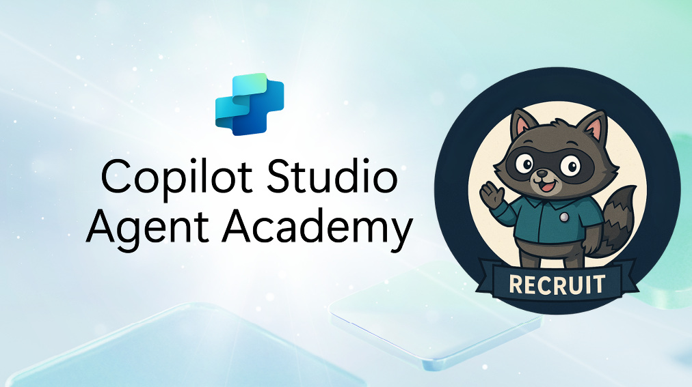

# 🧭 Agent Academy Onboarding Guide

Welcome, recruit. You’ve entered the dojo of Microsoft Copilot Studio—where declarative agents, adaptive cards, and orchestration flows await. This guide is your sparring partner, helping you dodge blockers and master deployment.

---

## 🎬 What This Is

A curated walkthrough of the Agent Academy experience, infused with real-world insights from hands-on sessions. It’s not just a guide—it’s a decoder ring for what learners *actually* struggle with.

  

<em>“Plug in. Learn fast.” — Agent Academy (allegedly...) 
Image © Microsoft, used under fair use for educational and thematic purposes.</em>

---

## 🧠 Before You Begin

- 🔌 Plug into [Agent Academy](https://microsoft.github.io/agent-academy/recruit/)
- 🧾 Bookmark your session notes and screenshots
- 🧠 Adopt the #EternallyCurious mindset—this isn’t just about building agents, it’s about understanding the architecture of intelligence

---

## 🧠 Alejandro’s Field Notes
See [`agent-academy-field-notes.md`](agent-academy-field-notes.md) for real-time insights and deployment anomalies.

---

## ⚠️ Common Friction Points

| Module | Challenge | Alejandro’s Insight |
|--------|-----------|---------------------|
| 03: Declarative Agent | Grounding prompts | Use clear, scoped instructions—avoid vague intents |
| 06: Custom Agent | Connecting knowledge sources | Watch for authentication errors and unsupported formats |
| 08: Adaptive Cards | Power Fx + SharePoint | Test in isolation before embedding—debugging is brutal |
| 09: Agent Flows | Triggering backend logic | Map out flow logic visually before building |
| 11: Deployment | Publishing to Teams | Use incognito for testing—Teams caching is sneaky |

---

## 🧪 Alejandro’s Deployment Notes

> _“You are the eventuality of an anomaly…” — The Architect_

- ✅ Adaptive cards rendered inconsistently across channels—test in Teams and Web Chat
- 🧩 SharePoint integration required manual connector setup—document this for learners
- 🧠 Agent grounding improved dramatically with persona-based prompt design
- 🛠️ Deployment to M365 Copilot required tenant-level permissions—flag this early

---

## 🧠 Pro Tips

- Use visuals from [`assets/`](../assets/) to reinforce concepts
- Link to demos in [`copilot-demos/`](../copilot-demos/) (in the making...)
- Encourage learners to fork the repo and document their own anomalies 

---

## 🏁 Next Steps

- Explore [`architecture-overview.md`](architecture-overview.md) (in the making...)
- Clone a demo from [`copilot-demos/`](../copilot-demos/) (in the making...)
- Submit feedback or open a PR with your own onboarding insights

---

> _“The problem is choice.”_ — The Architect

#EternallyCurious | #AgentAcademy | #iKnowKungFu
